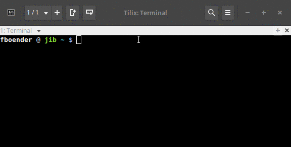

sshbg
=====

Change terminal background color when SSH'ing.

**Important notice**: I do not provide support
for this repository. Please do not file feature requests for different
terminals or bug reports if this setup does not work for you.

(Yes, all the hosts are actually localhost. I was lazy).

## Supported emulators, caveat and problems

This **doesn't work** with:

* Almost every terminal emulator in existence (Terminator, Gnome terminal,
  XFCE terminal, anything based on libvte).
* When you're using `ControlMaster auto` in your SSH config.

The following terminal emulators are supported:

* [Tilix](https://github.com/gnunn1/tilix)
* Xterm

To check if your terminal is supported, paste the following in your terminal:

     echo -e "\033]11;#007F00\a"

If the background of your terminal changes to green, it is supported.

**Don't ask me for support for your specific terminal**. Chances are
very good that it can't be supported.

## How does it work?

Black unix magic. Well, not really. Well, kinda...

SSH lets you run a local command before the connection to the remote host is
established. Some terminals allow you to set the background color with an
escape sequence. It's possible to detect if the SSH command has exited from
the locally executed command by polling the parent process PID in the
backgrond. Combine the three and presto! Background colors.

sshbg matches (regex) entries in a configuration file against the provided
hostname. That results in a profile name, which has a background color
associated with it. See the "Config file" section at the bottom of this page
for more info.

## Installation and usage

Requirements:

* Python v2.6+ / v3.x+
* A supported terminal

Clone this repo:

    git clone git@github.com:fboender/sshbg.git
    cd sshbg

Copy the `sshbg` script to some dir in your PATH, for example:

    sudo cp sshbg /usr/local/bin/

Copy the `sshbg.conf` file to `~/.config/sshbg.conf`:

    cp sshbg.conf ~/.config/

Enable the `LocalCommand` configuration setting in your SSH config. You can do
this on a host-by-host basis, or with wildcards. To enable it for all hosts,
make your SSH config look like this:

    $ cat ~/.ssh/config
    PermitLocalCommand yes
    Host *
        LocalCommand sshbg "%n"

## Config file

The config file is a JSON file that looks like this:

    {
        "normal_bg_color": "#000000",
        "profiles": {
            "prod": "#2F0100",
            "uat": "#1A1400",
            "test": "#011A00"
        },
        "hostnames": {
            "test.dev.local": "test",
            "uat.dev.local": "uat",
            "prod.dev.local": "prod",
            ".*-prod.*": "prod",
            "acc.*": "uat"
        }
    }

The keys:

* `normal_bg_color`: The normal background color of your terminal, which
  sshbg will reset your terminal to when the SSH command returns.
* `profiles`: The list of profile names and their associated colors. You
  can name these whatever you want.
* `hostnames`: Regular expressions that are matched against the hostname
  you're SSH'ign too. If the regex matches, the profile is selected.

## Remarks, weirdness and bugs.

* The hostname is the one you specify on the commandline, **NOT** necessarily
  the real remote hostname.
* Manually chained SSH (`ssh machine_a -> ssh machine_b`) will not work.
  Automatically chained SSH (through `ProxyCommand`) *will* work.
* When SSH exits, the terminal background color is reset to the value of
  `normal_bg_color` in the configuration file. I have not yet found a way to
  reset the original terminal color as defined in your terminal.
* After the background color is set by sshbg, your terminal probably can't
  change the background color itself anymore. No idea why.
* Probably a million different strange behaviours. Did I mention I don't
  support this project already?

## License

MIT license. See `LICENSE` file.
